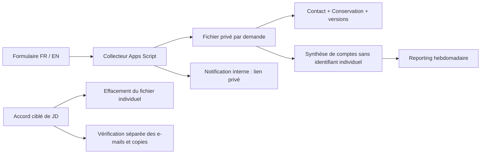

# Stockage du formulaire par dossier

Proposition technique interne du 6 octobre 2026, préparée après « go » de JD. Ce document définit la cible et les conditions de bascule ; le collecteur Google actuellement déployé reste en version 1. Aucun fichier réel créé, déplacé ou supprimé pour cette préparation. Les durées nouvelles proposées ci-dessous ne sont pas adoptées dans les textes juridiques.

Construction suivante après le nouveau « go » : [candidat séparé](../../tools/forms/candidate/README.md) écrit et testé localement, vingt tests propres au candidat réussis, trente-sept avec les régressions Contact/reporting. La recette Google et la bascule ne sont pas effectuées. [Rapport de construction](../../reports/contact-storage-candidate-20261006.md).

## Choix proposé

Conserver Google Workspace et Apps Script, avec **un fichier Google Sheets privé par demande**, dans un dossier Drive privé créé par l’application. Le dossier individuel contient la demande, la preuve de consentement et son suivi de conservation. Supprimer ce fichier retire les versions accessibles de ce seul dossier. Les échanges Gmail, exports et copies restent à vérifier séparément.

Ne plus écrire les coordonnées ou le message dans un classeur collectif. Ne plus reproduire la demande dans la notification. Ne pas créer de registre central permanent reliant noms, e-mails, références et identifiants de fichiers : son propre historique recréerait le problème.

Cette proposition suit le résultat de la [recette isolée](../../reports/retention-isolated-20261006.md). L’effacement du fichier est vérifié côté client ; la recette ne démontre pas une purge immédiate des infrastructures Google. L’ancien historique Contact conserve le dossier fictif déjà effacé de la feuille courante.

## Objets et données

| Objet | Contenu proposé | Règle |
|---|---|---|
| Dossier Drive des demandes | Fichiers individuels uniquement | Propriétaire jd@nodina.com ; aucun partage public, domaine ou groupe ; vérifier aussi les permissions héritées |
| Fichier `NODINA — Demande — <UUID>` | Un seul dossier ; aucun nom ou e-mail dans le titre | L’UUID et l’ID Drive restent des références pseudonymes, pas des données déclarées anonymes |
| Onglet Contact individuel | Les dix-sept colonnes actuelles, une seule ligne de demande | Preuve `contact-v1`, timestamp de réception, coordonnées et message conservés ensemble ; texte brut, aucune formule venant du visiteur |
| Onglet Conservation individuel | Statut, dernier échange, échéance, responsable, vérifications des copies et justification d’une exception | Douze mois calendaires après le dernier échange pour Sans suite ; les demandes de droits suivent leur propre examen |
| Propriétés du fichier | Marqueur de schéma, UUID, état d’écriture | Pas de coordonnées ou message ; métadonnées de corrélation effacées avec le fichier |
| Notification Gmail | Objet fixe, référence et URL privée | Ni nom, ni adresse du prospect, ni contexte, ni pièce jointe ; pas de Reply-To vers le prospect |
| Synthèse privée de reporting | Jour de réception, page source autorisée, compte, date du calcul et couverture | Aucun UUID, ID Drive, e-mail, nom, message, lien individuel ou horodatage précis |
| État technique temporaire | Référence pseudonyme, phase d’écriture, ID si connu, expiration | Pas dans un Sheet avec historique ; durée et retrait explicites ; aucun corps de demande journalisé |

Le fichier est créé vide et privé avant toute écriture de coordonnées ; contrôler le dossier parent et les permissions. Si ce contrôle échoue, arrêter le traitement et ne pas envoyer de notification. Le lien ne confère aucun accès au visiteur. L’accès de JD au dossier n’élargit pas celui du reporting.

Les commentaires, notes, copies et raccourcis ne doivent pas servir à stocker une deuxième demande. Si un prospect soumet plusieurs demandes, chacune a son fichier ; une demande de droits recherche tous ses dossiers pertinents, pas seulement le dernier UUID.

## Réception et erreurs

Réutiliser les limites de champs, la validation du consentement, le contrôle anti-formule, le verrou Apps Script et les confirmations FR/EN. Les réponses publiques restent `ok`, `invalid` ou `unavailable`, sans ID Drive, URL privée, coordonnées ou erreur Google. Ne pas modifier le libellé ou la version de consentement pour un changement interne de stockage seul.

1. Valider les champs ; vérifier la configuration, les permissions attendues et la disponibilité du stockage.
2. Sous verrou, rechercher la référence exacte dans les seuls fichiers de l’application, avec pagination et marqueur de schéma. Zéro résultat, un résultat et plusieurs résultats sont trois cas distincts ; plusieurs résultats déclenchent une revue, pas le choix du premier fichier.
3. Pour une nouvelle demande, enregistrer un état technique minimal de création en cours avant l’appel Drive. Créer le fichier avec sa référence dans les métadonnées, puis écrire Contact et Conservation. Relire les cellules attendues avant d’accepter la réception.
4. Si le fichier existe et est complet, une nouvelle tentative avec la même référence et le même contenu valide renvoie la réception confirmée, sans seconde écriture ni notification. Même référence avec un contenu différent : ne pas écraser ; renvoyer une erreur générique.
5. Création ou écriture interrompue : reprendre le fichier identifié. Si la création a une issue inconnue et que le fichier ne peut pas être retrouvé, conserver le marqueur d’incertitude et retourner `unavailable` ; ne pas créer aveuglément un deuxième fichier. JD réconcilie l’état avant une nouvelle création. Aucun effacement automatique d’un fichier incomplet.
6. Une notification échouée ne perd pas le dossier. Inscrire `failed` dans le fichier individuel. Pour une issue d’envoi inconnue, inscrire `unknown`, sans relance automatique ; consulter Gmail avant de renvoyer.
7. Supprimer l’état temporaire de création seulement après réconciliation. Limiter le nombre d’opérations incertaines ; une limite atteinte bloque les nouvelles créations avec une erreur générique et demande une intervention, sans stockage de messages dans les journaux.

Google ne permet pas d’utiliser un ID Drive pré-généré pour créer un fichier Sheets natif. Un verrou et une recherche ne suffisent donc pas à affirmer une création exactement une fois après toute panne. Ce cas doit être testé, avec l’état d’incertitude ci-dessus. [Documentation des ID pré-générés](https://developers.google.com/workspace/drive/api/guides/manage-uploads#use_a_pre-generated_id_to_upload_files).

### Renvoi après effacement

Une recherche vide après suppression ne doit pas autoriser la recréation silencieuse du dossier. Prévoir une référence de soumission émise par le serveur, signée et valable pour une fenêtre limitée ; un visiteur ne peut pas obtenir une nouvelle validité pour une ancienne référence. Proposition de fenêtre : **24 heures**, à valider comme durée technique avant usage.

Pendant la validité d’une référence effacée, conserver seulement un marqueur de retrait pseudonyme dans l’état technique privé. Rejeter le renvoi ; après expiration du jeton, retirer ce marqueur. Les anciens jetons expirés restent refusés sans avoir besoin de conserver leurs identifiants indéfiniment. Le bilan de suppression mentionne ce reste temporaire jusqu’à son retrait vérifié ; ne pas marquer tout le dossier Effacé auparavant.

Ce mécanisme exige un changement du protocole de soumission. Les modes JavaScript et HTML sans JavaScript doivent tous deux obtenir une référence valable depuis une page ou une étape serveur. Ne pas casser le POST sans JavaScript, ni employer `started_at` envoyé par le navigateur comme une signature. Tant que cette recette n’est pas réussie, la bascule reste fermée. Le cache Apps Script, qui peut être évincé avant expiration, ne doit pas être l’unique mémoire du retrait. [Limites du cache](https://developers.google.com/apps-script/reference/cache/cache).

## Effacement opérationnel

L’échéance signale un dossier à examiner ; elle ne lance aucune suppression. À chaque action irréversible, JD confirme les fichiers et messages exacts. Le point d’entrée public du formulaire n’accepte **aucune commande de suppression**, aucun paramètre de partage et aucun choix de destinataire.

Avant l’action : vérifier l’identité et les exceptions, toutes les demandes pertinentes, l’ID, le titre, la référence interne, le parent, le propriétaire et la séparation des autres dossiers. Préparer le marqueur temporaire empêchant le renvoi si un jeton est encore valable. Supprimer le seul fichier autorisé, jamais le dossier parent ; supprimer un dossier Drive peut supprimer ses descendants. [Drive files.delete](https://developers.google.com/workspace/drive/api/reference/rest/v3/files/delete).

Après l’action : succès explicite du service, ID introuvable, recherche exacte sans exclusion de la corbeille et URL indisponible. Vérifier les notifications dans Reçus, Envoyés et Corbeille, les échanges, exports et copies du client. Documenter séparément une conservation justifiée ou un reste temporaire. Aucune capture contenant les données d’un prospect ne doit entrer dans ce dépôt comme preuve.

La trace d’une demande de droits doit avoir sa propre finalité et sa durée validée. Conserver seulement une preuve minimale dans un suivi privé ; ne pas promettre l’absence de toute donnée si cette correspondance, un marqueur technique, une copie ou une conservation justifiée reste présente.

## Reporting compatible avec l’effacement

Le collecteur de reporting actuel lit Contact et exclut les essais d’après `name` ou `ref`. Le séparer du contenu des dossiers : un calcul interne au service Contact produit une synthèse privée par jour et page, après exclusion des TEST. Le reporting hebdomadaire lit seulement cette synthèse avec son droit Sheets en lecture seule existant. Il n’a besoin d’aucun droit Drive supplémentaire.

Reconstruire la synthèse à partir des dossiers **encore conservés**, sans incréments par réception : un recomptage évite un double compte après une panne ou une nouvelle tentative. La métrique porte alors sur les demandes conservées reçues pendant une période, et peut diminuer après un effacement. Elle ne représente pas un total historique immuable de toutes les soumissions.

Le calcul utilise uniquement timestamp, page source et indicateur de TEST dans les dossiers ; il ne copie pas les autres champs. Produire une synthèse complète avant publication ; si un fichier attendu est illisible, un schéma est invalide ou une pagination est incomplète, publier un état indisponible, jamais un total partiel présenté comme exact ou zéro. Le lecteur rejette une synthèse périmée ou incomplète. Une reconstruction suit un effacement ; l’absence de dossier et le retrait du marqueur temporaire sont vérifiés séparément du compte statistique.

Ne pas créer de miroir des références individuelles dans le fichier de synthèse. Des comptes faibles ou recoupables ne sont pas automatiquement anonymes ; garder le reporting privé, conserver les avertissements sur les petits échantillons et ne pas étendre les dimensions. La qualification reste `null` tant qu’elle n’est pas définie et consignée. Marquer la date de changement de source dans le premier rapport, sans additionner ancien et nouveau flux comme s’ils avaient la même couverture.

## Droits et limites à éprouver

Le périmètre proposé est le même compte Workspace, le même destinataire interne et les mêmes services fournisseurs. Le script crée lui-même son dossier, les fichiers individuels et la synthèse, puis les gère avec les API Drive et Sheets. Viser `drive.file` et le droit d’envoi MailApp, avec les scopes requis par le transport retenu ; remplacer les appels `SpreadsheetApp` exigeant le scope Sheets global.

`drive.file` vise les fichiers créés par l’application ou explicitement ouverts avec elle ; écrire un ID de dossier existant dans une propriété n’accorde pas automatiquement l’accès. Le dossier nouveau doit donc être créé par l’application ou faire l’objet d’un accès explicite éprouvé. [Périmètres Drive](https://developers.google.com/workspace/drive/api/guides/api-specific-auth), [écriture Sheets et scopes acceptés](https://developers.google.com/workspace/sheets/api/reference/rest/v4/spreadsheets.values/update).

L’ajout de ce droit exige un consentement de JD ; aucun droit n’est accordé ici. Les permissions limitées, le parent et l’accès aux fichiers doivent être vérifiés en vraie recette. Ne pas élargir silencieusement à `drive` sur tout le compte en cas d’échec. La suppression peut rester une opération manuelle ciblée avec le connecteur existant ; aucun job de purge planifié proposé pour cette première version.

Un fichier par demande augmente les appels, le nombre de fichiers et le temps de calcul. Vérifier les quotas de création, de lecture et de notification, ainsi que la charge réelle avant la bascule. Aucun volume ou coût garanti ; aucune offre payante souscrite. [Quotas Apps Script](https://developers.google.com/apps-script/guides/services/quotas).

## Migration et critères d’acceptation

1. Préparer le collecteur candidat et l’adaptation du reporting dans des fichiers séparés de la version active. Tester localement validation, doublons, erreurs et protocole de référence. Aucun changement de propriété du service actuel.
2. Après accord sur la cible et les droits, JD autorise le service nécessaire. Recette privée avec deux dossiers fictifs A et B, envoi FR/EN et mode sans JavaScript. Vérifier les permissions réelles du parent et de chaque fichier avant écriture.
3. Créer deux versions de A, une version de B. Après accord ciblé de suppression de A, vérifier A indisponible, B et ses valeurs inchangés, notification A retirée, marqueur temporaire puis expiration vérifiés, renvoi de A refusé. Tester aussi une création interrompue, une notification inconnue et une pagination comportant plusieurs pages.
4. Vérifier la synthèse : inventaire de deux fichiers puis un après effacement ; les seuls TEST comptent zéro demande commerciale, aucune donnée ou référence individuelle exportée ; panne de lecture = indisponible. La variation 2 → 1 de comptes non TEST est simulée localement avec des valeurs fictives. Le reporting doit lire cette nouvelle source sans nouveaux droits sur les dossiers.
5. Préparer une version déployable, sa configuration, l’URL de confirmation et le point de retour arrière. JD approuve la bascule ; enregistrer sa date et la version. Retour arrière pour les nouvelles soumissions seulement : ne pas recopier les nouveaux dossiers dans Contact et ne pas restaurer un dossier effacé.
6. Traiter l’ancien classeur séparément. Il contient trois anciens TEST et la référence fictive encore présente dans l’historique. Le conserver explicitement comme ancien périmètre à traiter ; déplacer ses lignes ne supprimerait pas ses versions. Toute suppression de ce classeur et de son historique nécessite un inventaire et un accord distincts sur le fichier entier. Aucun nettoyage ancien déduit du « go ».

**Bascule ouverte uniquement si** permissions minimales, deux modes de formulaire, reprise après panne, retrait avec versions, prévention du renvoi et reporting sont tous vérifiés dans Google. Le candidat et ses tests locaux sont construits ; cette recette reste à exécuter. Le consentement `contact-v1` et la durée de douze mois déjà décidés ne sont pas remis en question.
